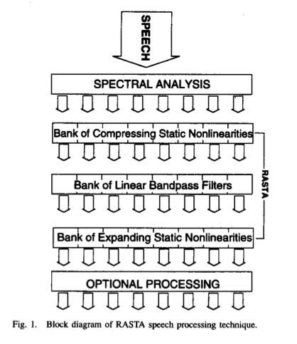
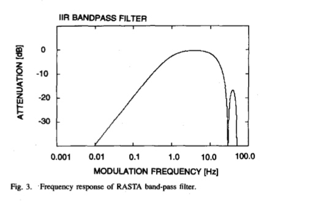
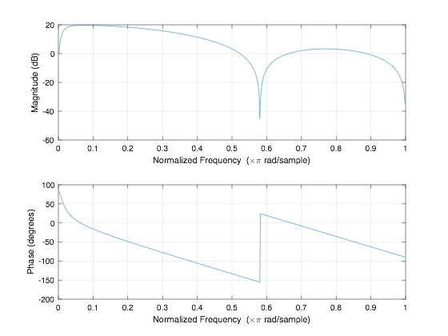

# RASTA(Relative Spectral Transform)
下面的介绍摘自[PLP and RASTA (and MFCC, and inversion) in Matlab](https://labrosa.ee.columbia.edu/matlab/rastamat/)

> RASTA is a separate technique from RASTA-PLP(Relative Spectral Transform - Perceptual Linear Prediction, a popular speech feature representation). RASTA applies a band-pass filter to the energy in each frequency subband in order to smooth over short-term noise variation and to remove any constant offset resulting from static spectral coloration in the speech channel

RASTA的提出者Hermansky在论文中写道
> It suppresses the spectral components that change more slowly or quickly that the typical range of change speech

计算过程[^hermansky1994]

1. Compute the critical-band power spectrum
2. Transform spectral amplitude through compressing statistic nonlinear tranformation

    取对数
3. Filter the time trajectory of each transformed spectral component

    使用IIR滤波器，其传递函数为
    
    $$H(z)=0.1z^4*\frac{2+z^{-1}-z^{-3}-2z^{-4}}{1-0.98z^{-1}}$$
    
    但是在实验中，最终分母中的0.98改成了0.94，滤波器的time constant从原来的500ms减至160ms。论文中给出的滤波器的幅频响应
    
    
    自己用Matlab画出的幅频、相频响应曲线
    

    **非因果**
    
在实现过程中，可以分步实现该滤波器。首先$z^{4}$即是将输入信号提前4个采样点，剩下的部分即是因果系统了。但设置延时的目的动机是什么？

4. Transform the filtered speech representation through expanding static nonlinear transformation

    与步骤2相反，取指数
上述计算结果即为RASTA，如果在此基础上再计算PLP即可得到RASTA-PLP，即
5. Multiply by the equal loudness curve and raise to the power 0.33 to simulate the power low of hearing
6. Compute an all-pole model of the resulting spectrum, following the conventional PLP techinique

[^hermansky]: Hermansky H, Morgan N. RASTA processing of speech[J]. IEEE transactions on speech and audio processing, 1994, 2(4): 578-589.
